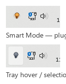
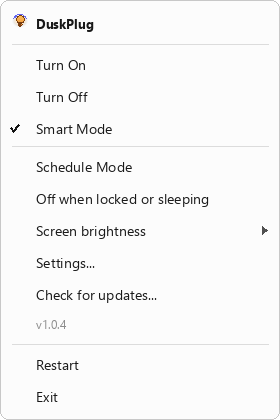
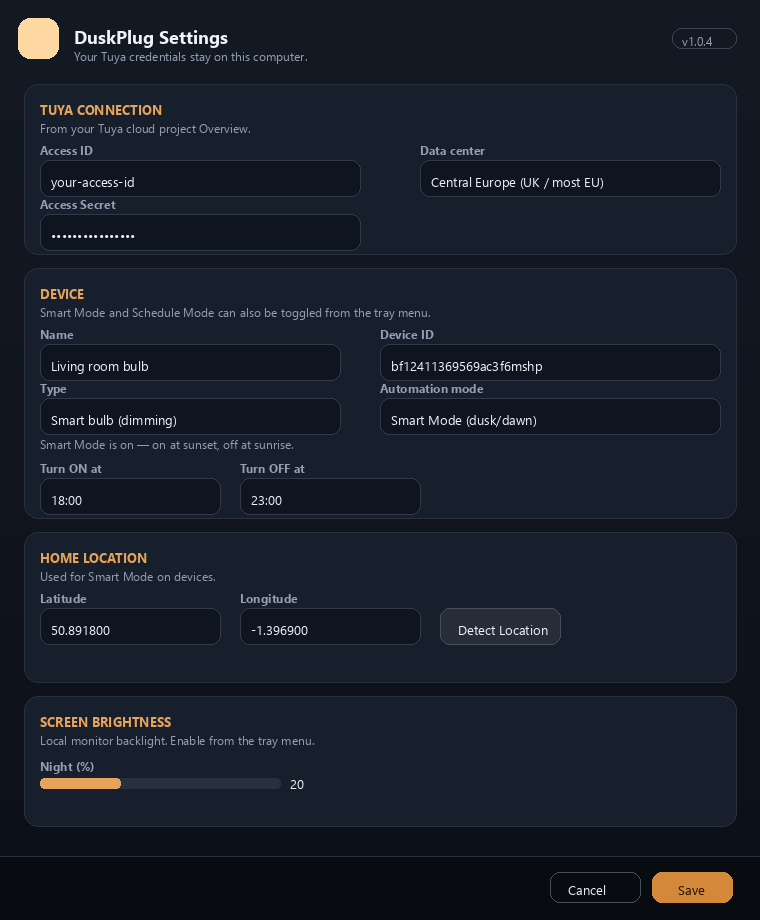

# DuskPlug

[](https://github.com/DuskPlug/DuskPlug/actions/workflows/ci.yml)

Control Tuya smart plugs and dimmable bulbs from the system tray (Windows, Linux) or menu bar (macOS) — manual on/off plus per-device **Smart Mode** (on at dusk, off at dawn), **Schedule Mode** (fixed daily times), and optional night/day brightness for bulbs.

Free, open source, and MIT-licensed. You only need your own free Tuya cloud project — no DuskPlug account.

## Screenshots

**System tray** (real Windows 11 taskbar):



**Context menu**:



**Settings**:



## Why DuskPlug?

- **Free and open source** — MIT license, no subscription
- **Your Tuya project only** — credentials stay on your PC (see config paths below)
- **Multi-device** — plugs and dimmable bulbs, each with its own automation mode
- **Smart Mode** — sunset on, sunrise off from your location (per device)
- **Schedule Mode** — fixed daily on/off times (per device)
- **Bulb brightness** — optional night/day dimming for supported bulbs
- **Easy install** — MSI installer or portable ZIP

## Download

**Installer (recommended):** download **DuskPlug.msi** from [GitHub Releases](https://github.com/DuskPlug/DuskPlug/releases) and run it. That installs to Program Files, adds a Start menu shortcut, and starts DuskPlug when you log in. First run opens **Settings**.

**Portable ZIP:** download **DuskPlug-Windows.zip**, unzip it anywhere, and double-click **`Start-DuskPlug.cmd`**.

**Linux:** download **DuskPlug-Linux-x64.tar.gz**, extract it, and run `./duskplug`. GNOME may need an [AppIndicator extension](https://extensions.gnome.org/extension/615/appindicator-support/) for the tray icon.

**macOS:** download **DuskPlug-macOS.zip**, unzip **DuskPlug.app**, and open it (unsigned builds: right-click → Open the first time). Allow location access when Smart Mode requests it.

Code signing via [SignPath Foundation](https://signpath.org) (pending approval). Windows builds will be Authenticode-signed once approved. macOS builds are unsigned until Apple notarization is set up.

If you cloned this repo instead, run **`Build-DuskPlug.cmd`**. **`Build-Msi.cmd`** builds the installer (needs the .NET SDK).

Full walkthrough (Tuya portal screens, linking the phone app, and every Settings field): **[Getting started](docs/GETTING-STARTED.md)**.

Privacy: [Privacy Policy](docs/PRIVACY.md)

## Set up a Tuya cloud project (one-time)

You need a free [Tuya Developer Platform](https://iot.tuya.com) project so Windows can talk to the same plug as your phone. The plug must already work in **Smart Life**, **Tuya**, or **Status**.

1. **Check the phone app region**  
   **Me → Setting → Account and Security → Region**.  
   The cloud project data center must serve that region. UK **Smart Life** accounts are usually **Central Europe**; if devices do not appear after linking, try **Western Europe** (Tuya added that data center in 2025).

2. **Create a developer account** at [iot.tuya.com](https://iot.tuya.com) (**Tuya Smart Developer Center**) and sign in.

3. **Create a cloud project**  
   Sidebar **Cloud → Cloud Project → Project Management** (or **Cloud → Development**).  
   Click **Upgrade IoT Core Plan** if shown (free trial), then **Create Cloud Project**.  
   - **Development Method:** **Smart Home** (not Custom)  
   - **Data Center:** match the phone app region  

4. **Authorize API Services** in the wizard. Keep the defaults and include **IoT Core**, **Authorization Token Management**, **Smart Home Basic Service**, and **Device Status Notification**. Click **Authorize**. Skip asset/user creation (that is for Custom projects).

5. **Copy credentials** — **Open Project** → **Overview** → **Authorization Key**:  
   - **Access ID / Client ID**  
   - **Access Secret / Client Secret**

6. **Link the phone app**  
   **Devices → Link Tuya App Account → Add App Account** → **Tuya App Account Authorization** → scan the QR code from the **same** phone app that already controls the plug → **Confirm**. Leave **Automatic Link** selected.  
   **All Devices** should then list your plug.

7. **Copy Device ID** from **Devices → All Devices** for each plug or bulb you want to control.

Do not put Access Secret or Device ID in git. DuskPlug stores them locally:

| OS | Config path |
|----|-------------|
| Windows | `%APPDATA%\SMART\config.json` |
| Linux | `~/.config/duskplug/config.json` |
| macOS | `~/Library/Application Support/DuskPlug/config.json` |

## Enter the configuration in DuskPlug

Double-click **`Start-DuskPlug.cmd`**. On first run, **Settings** opens automatically. Later: tray icon → right-click → **Settings...**

**Connection** (required):

| Field | What to enter |
|-------|----------------|
| **Access ID** | Access ID from Tuya Overview |
| **Access Secret** | Access Secret from Tuya Overview |
| **Data center** | Same Data Center as the project Overview |

Add one or more devices by **Device ID** (from All Devices). With a single device, Settings shows a flat page; with two or more, you get a device list and per-device detail pages.

Click **Save**.

**Smart Mode location:** click **Detect Location** (allow Windows location for desktop apps), type latitude/longitude, or paste a Google Maps pair such as `51.4809, -3.2092`.

**Automation:** choose **Manual**, **Smart**, or **Schedule** per device in Settings. For bulbs, set optional night/day brightness when using Smart or Schedule mode.

Alternatively, **`Setup.cmd`** is a terminal wizard that fills the same values, discovers plug vs bulb capabilities, and tests the live connection.

### Tray

A lightbulb appears near the clock. With one device, left-click toggles it. With multiple devices, left-click toggles all enabled devices and the menu lists each device separately. Right-click for **Turn all on/off** (when you have 2+ devices), **Off when locked or sleeping**, **Adjust screen brightness** (optional night/day backlight levels), **Settings...**, and the rest.

| Mode | What it does |
|------|----------------|
| **Manual** | You control the device from the tray (default) |
| **Smart** | On at sunset, off at sunrise — configured per device in Settings |
| **Schedule** | Follows that device’s daily ON/OFF times from Settings |

Optional: **`Install-Startup.cmd`** runs DuskPlug at Windows login.

## Updating

DuskPlug checks for updates once per day at startup and offers **Check for updates…** in the tray/menu. Downloads are verified with SHA256 before install.

| Install method | How to update |
|----------------|---------------|
| **winget** (`DuskPlug.DuskPlug`) | `winget upgrade DuskPlug.DuskPlug` — the app shows this hint instead of installing in-app |
| **Scoop** (`duskplug`) | `scoop update duskplug` |
| **MSI** (Program Files) | Tray → **Check for updates…** → **Update to vX.Y.Z** (one UAC prompt for the installer) |
| **Portable ZIP** | Same in-app flow; replaces `DuskPlug.exe` and `assets\` in place, then restarts |
| **Linux tarball** | Same in-app flow; replaces the `duskplug` binary and `assets/` folder |
| **macOS `.app` zip** | Same in-app flow; replaces the app bundle (unsigned builds may need Gatekeeper re-approval) |

Your config in `%APPDATA%\SMART\` (Windows), `~/.config/duskplug/` (Linux), or `~/Library/Application Support/DuskPlug/` (macOS) is preserved across updates.

### Troubleshooting

| Problem | Fix |
|---------|-----|
| Setup says sign invalid | Access ID / Secret wrong, or wrong data center — fix in **Settings** or re-run **`Setup.cmd`** |
| Device list empty in the Tuya portal | **Devices → Link Tuya App Account → Add App Account**, and check the data center |
| Smart Mode needs location | Windows **Settings → Privacy → Location** → allow desktop apps, then **Detect Location** in DuskPlug |
| No tray icon | Run **`Start-DuskPlug.cmd`** |

## Developers

### Build

**Windows**

```cmd
Build-DuskPlug.cmd
```

Or `cd cpp` and run `build.cmd`. Produces `DuskPlug.exe` in the project root.

Windows builds are incremental and parallel. The default is a fast **debug** binary (`-O0`). Use `Build-DuskPlug.cmd -Release` for an optimized build. `build.cmd -Clean` discards cached objects.

**Linux / macOS (CMake)**

```bash
cmake -S cpp -B cpp/build -DCMAKE_BUILD_TYPE=Release
cmake --build cpp/build
```

Or use `scripts/build-linux.sh` / `scripts/build-macos.sh` for release packages.

### Tests

```cmd
cpp\test.cmd
```

Before pushing from Windows, run the full CI test matrix locally:

```cmd
cpp\ci-check.cmd
```

That runs both `test.cmd` (Windows CI) and the CMake `duskplug_tests` target (Linux/macOS CI), so cross-platform linker gaps are caught before GitHub.

Linux/macOS: `cpp/build/duskplug_tests` after the CMake build above.

### Project layout

| Path | Purpose |
|------|---------|
| `cpp/src/` | DuskPlug C++ source |
| `lib/TuyaApi.ps1` | Tuya Cloud API helpers |
| `Setup.ps1` / `Setup.cmd` | Interactive setup wizard |
| `Plug-*.ps1` | Optional CLI helpers (same cloud API as the tray) |
| `config.example.json` | Public template (placeholders only) |
| `installer/` | WiX source for **DuskPlug.msi** |
| `packaging/` | winget and Scoop manifest sources |

Config is loaded from `%APPDATA%\SMART\config.json`. See [`cpp/README.md`](cpp/README.md) for Smart Mode details.

Releases: [`docs/RELEASE.md`](docs/RELEASE.md)

## License

MIT — see [LICENSE](LICENSE).
